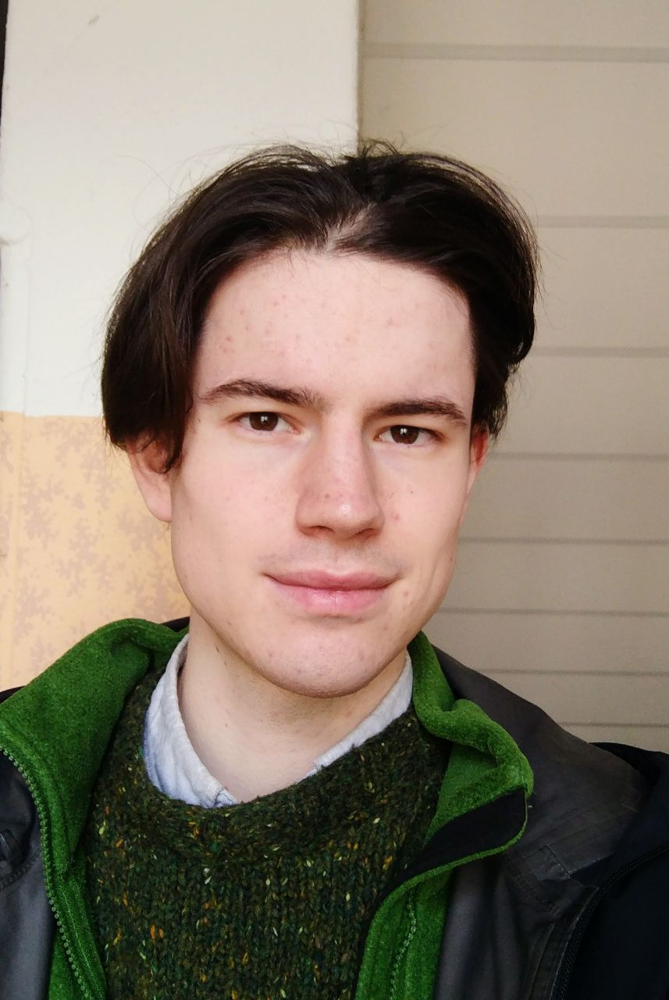

# QuTiBench
Neural Networks have become one of the most successful universal machine learning algorithms. 
They play a key role in enabling machine vision and speech recognition, and are increasingly 
adopted in other application domains. 
While the underlying computation is structurally simple, their computational complexity is enormous 
and comes along with equally challenging memory requirements both in regards to capacity and access bandwidth. 
This limits deployment in particular within energy constrained, embedded environments.  
In order to address these implementation challenges, a broad spectrum of new customized and heterogeneous 
hardware architectures have emerged, sometime referred to as deep learning processing units, 
often accompanied with co-designed algorithms to extract maximum benefit out of the hardware. 
Furthermore, numerous optimization techniques are being explored to reduce 
compute and memory requirements while maintaining accuracy.
This results in an abundance of algorithmic and architectural choices, some of which fit specific use cases 
better than others.  

For system level designers, there is currently no good way to compare the variety of hardware, algorithm and 
optimization options. While there are many benchmarking efforts in this field, they cover only subsections of 
the embedded design space.  None of the existing benchmarks support essential algorithmic optimizations such as 
quantization, an important technique to stay on chip, or specialized heterogeneous hardware architectures. 
We propose a novel benchmark suite, named QuTiBench, that addresses this need.  
QuTiBench is a novel multi-tiered benchmarking methodology that supports algorithmic optimizations such as 
quantization and helps system developers understand the benefits and limitations of these novel compute architectures 
in regards to specific neural networks and will help drive future innovation.  
We invite the community to contribute to QuTiBench in order to be able to support the full spectrum of choices 
in implementing machine learning systems.

# Contributing
See the [website](https://rcl-lab.github.io/QutibenchWeb/contributing/2020/04/09/Contributing_Measurements.html) for instructions on contributing.

# Publications
Blott, Michaela, et al. "QuTiBench: Benchmarking neural networks on heterogeneous hardware." ACM Journal on Emerging Technologies in Computing Systems (JETC) 15.4 (2019): 1-38. [https://arxiv.org/pdf/1909.05009.pdf ](https://arxiv.org/pdf/1909.05009.pdf)

Michaela Blott, Johannes Kath, Lisa Halder, Yaman Umuroglu, Nicholas Fraser, Giulio Gambardella, Miriam Leeser, and Linda Doyle. 2020. "Evaluation of Optimized CNNs on FPGA and non-FPGA based Accelerators using a Novel Benchmarking Approach." In The 2020 ACM/SIGDA International Symposium on Field-Programmable Gate Arrays (FPGA ’20). Association for Computing Machinery, New York, NY, USA, 317. [https://dl.acm.org/doi/10.1145/3373087.3375348 ](https://dl.acm.org/doi/10.1145/3373087.3375348).
 
Poster available [here](https://github.com/michaelablott/QuTiBench/blob/master/Publications/FPGA2020_EvalCNNs_Poster.pdf)

# About us

### Michaela Blott

Michaela Blott is a Distinguished Engineer at Xilinx Research in Dublin, Ireland, where she heads a team of international scientists driving exciting research to define new application domains for Xilinx devices, such as machine learning, in both embedded and hyperscale deployments. She earned her Master’s degree from the University of Kaiserslautern in Germany and brings over 25 years of computer architecture, FPGA and board design, in research institutions (ETH Zurich and Bell Labs) and development organizations. She is heavily involved with the international research community serving as the technical co-chair of FPL’2018, workshop organizer (H2RC), industry advisor on numerous EU projects, and member of numerous technical program committees (FPL, ISFPGA, DATE, etc.).
 
Contact: mblott@xilinx.com
 
### Miriam Leeser

Miriam Leeser is Professor of Electrical and Computer Engineering at Northeastern University.  Her research interests are in hardware accelerators, including FPGAs and GPUs, as well as  floating point implementations, unsupervised learning, medical imaging, privacy preserving data processing and wireless networking and security.  She received her BS degree in Electrical Engineering from Cornell University, and Diploma and Ph.D. Degrees in Computer Science from Cambridge University in England.  She has been a faculty member at Northeastern since 1996, where she is head of the Reconfigurable and GPU Computing Laboratory and a member of the Computer Engineering group.  She is a senior member of ACM, IEEE and SWE. Throughout her career she has been funded by both government agencies and companies, including DARPA, NSF, Google, MathWorks and Microsoft. She received the prestigious Fulbright Scholar Award in 2018.
 
Contact: <a href="https://coe.northeastern.edu/Research/rcl/members/MEL/index.html">mel@coe.neu.edu</a>

### Linda Doyle

### Johannes Kath

Johannes Kath is an undergraduate student of Information Systems Technology at Dresden University of Technology. During an internship at Xilinx Research Labs he worked on benchmarking and optimization of Neural Networks on heterogeneous architectures as part of his Master's Degree.
 
Contact:johannes.kath@mailbox.tu-dresden.de
 
 
 
 

### Lisa Halder

Lisa Halder studied Communications and Computer Engineering at Ulm University. During her Master's degree she was an intern at Xilinx and wrote her thesis about benchmarking of Neural Networks on heterogeneous architectures as collaboration with Xilinx Research. She now works as Software Developer at Institut Dr. Förster GmbH & Co. KG.
 
Contact: lisa.halder@gmx.de

### Zachary Neveu 
 
Zachary Neveu was an undergraduate student at Northeastern University and now works at [Modulate.ai](https://modulate.ai).
 
Contact: zachary.neveu@gmail.com
  
  
  
  
  
  
 
### Alina Vasilciuc 
 
Alina Vasilciuc is an undergraduate student at [Nova University of Lisbon](https://www.unl.pt/en), currently working on her Master’s degree in collaboration with Xilinx Research, where she is currently doing an internship.
 
Contact: [alina.vasilciuc@hotmail.com](https://pt.linkedin.com/in/alina-vasilciuc).
